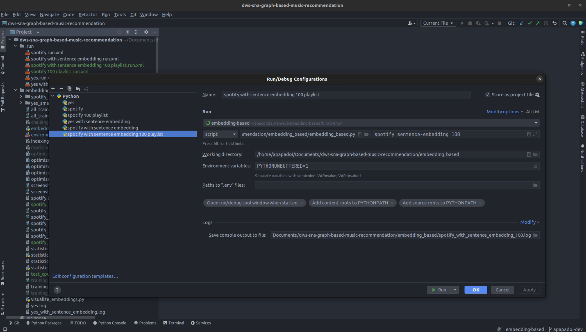

# Graph-based music recommendation

## MSc Data and Web Science @ AUTh

## Course: Social Network Analysis - Winter semester 2023-24

# CORLP
Complex Number Representation Link Prediction Music Recommendation 
## Installing 
To run the ```corlp.ipynb``` first, install all the required libraries. To do so, change the directory in the CORLP folder,
```
cd CORLP
```
and then install the libraries with:
```
pip install -r requirements.txt
```
and then simply run the notebook.

# HIN

Heterogeneous information network-based music recommendation system.

## Installing

To run the ```HIN.ipynb``` first install all the required libraries with:

```
pip install -r hin_requirements.txt
```
and then simply run the notebook.

# Graph embedding-based methods

For executing the code, first cd into the corresponding folder:

```
cd embedding_based
```

Then create the Anaconda environment using:

```
conda env create -f environment.yml
```

and activate it using:

```
conda activate embedding-based
```

You can then run each corresponding method using the following commands:

```
- python3 embedding_based.py spotify default 100
- python3 embedding_based.py spotify sentence-embedding 100
```

Or if you prefer, you can use PyCharm run configurations as shown below (after creating and selecting the Anaconda environment embedding-based and opening the root folder of the repository in PyCharm):

For PoissonEmbedding:


For SentencePoissonEmbedding:



When using PyCharm the result can be found in the corresponding log files, otherwise the results are shown to the console. The results for the 10 testing experiments are shown at the end of each log file or the console output.
## **Authors:**

#### Anastasios Papadopoulos ([apapadoi@csd.auth.gr](mailto:apapadoi@csd.auth.gr))

#### Eleni Mandana ([emandan@csd.auth.gr](mailto:emandan@csd.auth.gr))

#### Dimitrios Markou ([dmarkou@csd.auth.gr](mailto:dmarkou@csd.auth.gr))
